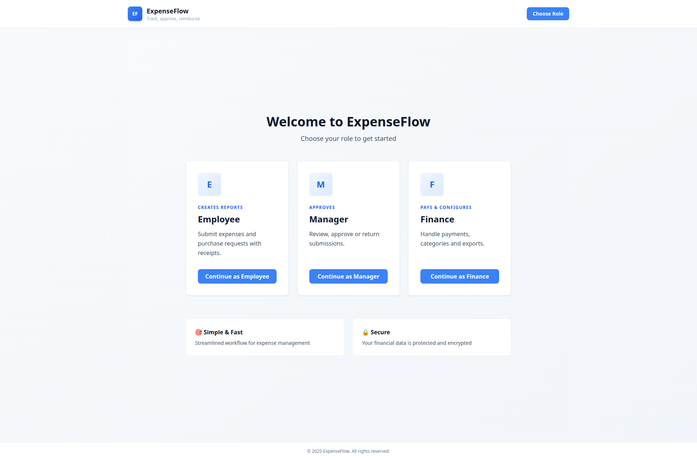
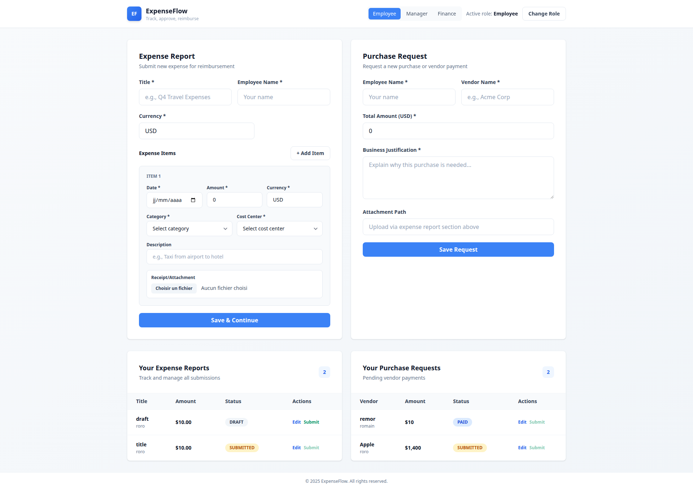
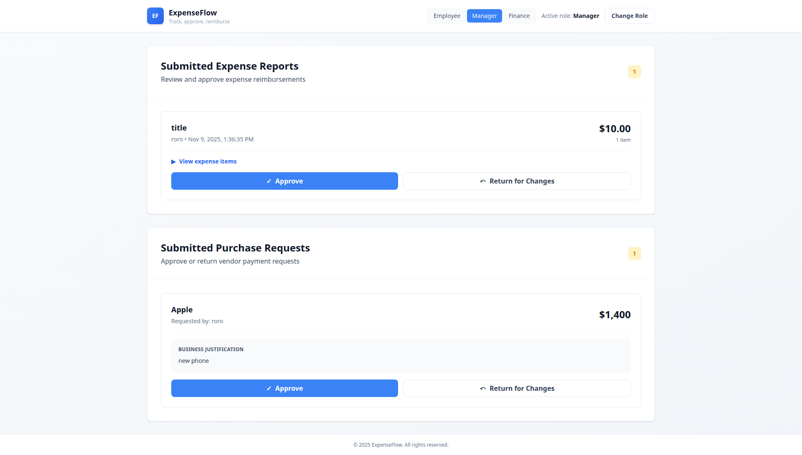
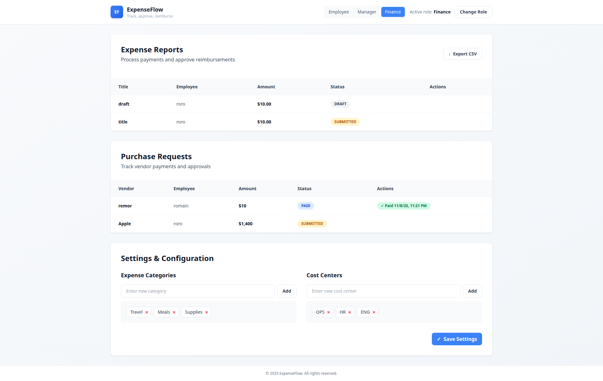

# ExpenseFlow

ExpenseFlow is a lightweight expenses and purchase request demo that showcases a Spring Boot 3 + Postgres backend and an Angular + Tailwind frontend. Users can switch between Employee, Manager, and Finance roles without real authentication to demo the core flows (submit, approve/return, mark as paid, manage categories, and export CSV).

## Tech stack

- **Frontend:** Angular 17 (standalone APIs), TailwindCSS, RxJS, Angular Router & Reactive Forms.
- **Backend:** Java 21, Spring Boot 3.2, Spring Data JPA, Bean Validation, Flyway, PostgreSQL 17.
- **Infrastructure:** Docker & Docker Compose, Nginx for static hosting/proxying, volume-backed uploads and Postgres data.

## Project structure

```
backend/   # Spring Boot service
frontend/  # Angular application
Sprints.md # 10 sprint log per delivery rules
```

Key backend folders: `controller`, `service`, `repository`, `entity`, `dto`, `config`, `exception`, `mapper`, plus Flyway migrations in `src/main/resources/db/migration`.

Key frontend folders: `src/app/components` (role dashboards), `src/app/services` (API client), `src/app/core` (role + notification services), and global styling/Tailwind config.

## Running with Docker Compose (recommended)

1. Ensure Docker/Docker Compose are installed.
2. From the repo root run:
   ```bash
   docker compose up --build
   ```
3. Open http://localhost:4200 to use the UI. The backend is exposed on http://localhost:8080 (override via `BACKEND_PORT` if needed) and Postgres on port 5432.
4. Uploaded receipts live in the named `uploads` volume; database data persists in `db-data`.

## Manual local run

### Backend
1. Install JDK 21 and Maven.
2. Start Postgres 17 locally (or use Docker) with database `expenseflow`, user/password `expenseflow`.
3. From `backend/` run:
   ```bash
   mvn spring-boot:run
   ```
4. Backend listens on `http://localhost:8080` (configurable via `SERVER_PORT`) and uses `uploads/` for files (auto-created).

### Frontend
1. Install Node 20+ and npm.
2. From `frontend/` run:
   ```bash
   npm install
   npm start
   ```
3. UI served at `http://localhost:4200` and, via `proxy.conf.json`, forwards `/api` calls to `http://localhost:8080` (update the proxy target if you expose the backend elsewhere).

## Environment variables

Backend (see `docker-compose.yml`):
- `DB_URL`, `DB_USERNAME`, `DB_PASSWORD` – Postgres connection.
- `UPLOAD_DIR` – where receipts are stored (defaults to `uploads`).
- `ALLOWED_ORIGINS` – comma-separated URLs allowed via CORS (defaults to `*` for demo convenience; set specific origins for production).
- `BACKEND_PORT` – host port mapped to the backend container (defaults to `8080`; change if the port is busy).

Frontend production build proxies `/api` to the backend via Nginx (`frontend/nginx.conf`). For Docker usage the backend is reachable internally at `http://backend:8080`; use `BACKEND_PORT` to choose which host port to expose. For local dev, change `environment.ts` if your API host differs.

## Features

- Role selector (Employee, Manager, Finance) stored in localStorage.
- Employee:
  - Build reports with dynamic items, categories/cost centers, currency, and receipt uploads.
  - Create purchase requests and submit drafts.
- Manager:
  - Review submitted reports/requests, inspect line items, approve or return with comment prompts.
- Finance:
  - Mark approved items as paid with notes, manage categories/cost centers, export CSV snapshots.
- Backend:
  - RESTful API with pagination/filtering, DTO validation, CSV export, file upload/download endpoints, and Postgres persistence via Flyway schema.

## UI Preview

Below are full-page screenshots captured at 1920×1080 to give a quick glimpse of each role experience.

| Role Selector | Employee Dashboard |
| --- | --- |
|  |  |

| Manager Dashboard | Finance Dashboard |
| --- | --- |
|  |  |

## Testing & caveats

- Automated tests were not executed in this environment (offline restrictions). Maven/Angular test targets are configured and can be run locally once dependencies are installed (`mvn test`, `npm test`).
- When running outside Docker, ensure Postgres is reachable and the `uploads` directory is writable.

## Sprint log

See [`Sprints.md`](Sprints.md) for the 10 sprint breakdown and checkpoints per delivery requirements.
